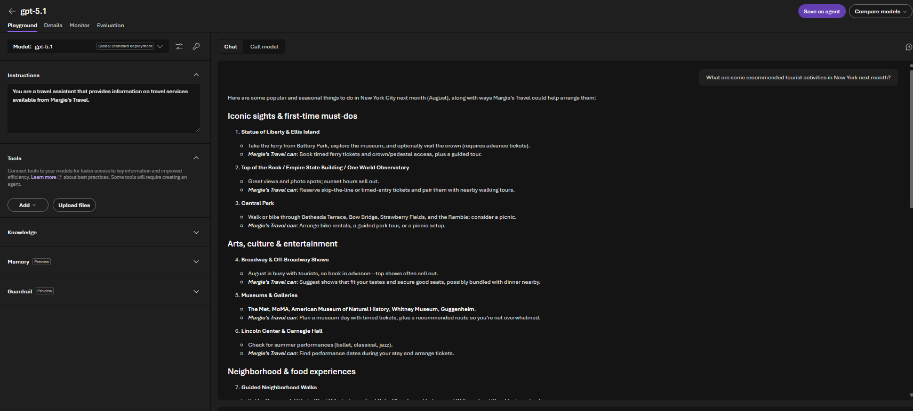
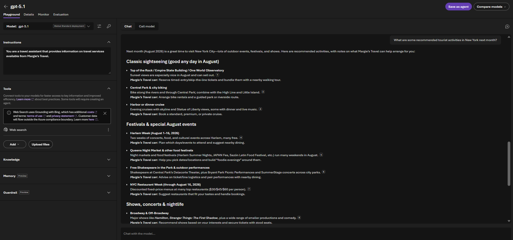
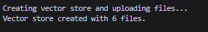
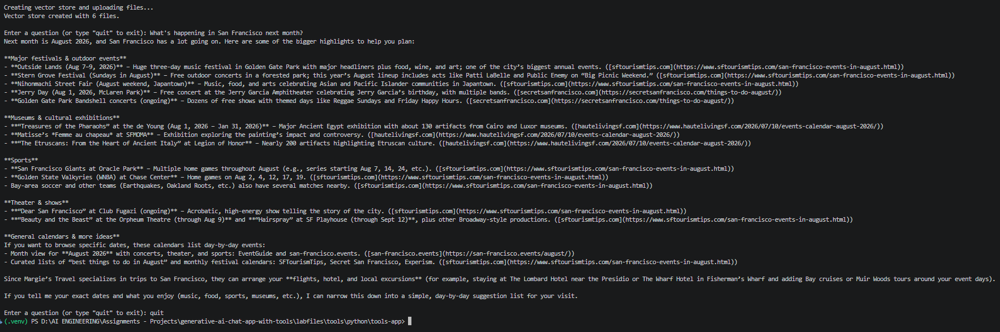
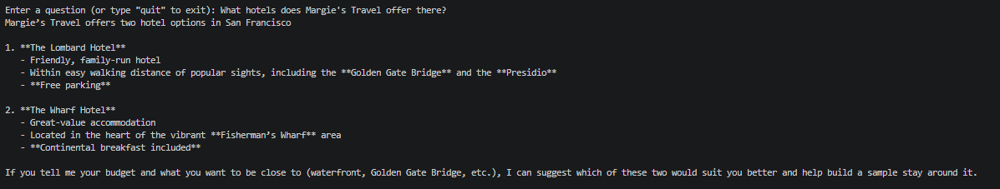

# Generative AI App with Tools Microsoft Foundry

A hands-on exercise building an AI chat application with the **OpenAI SDK** and **Responses API**, extended with `web_search` and `file_search` tools to ground a GPT model's answers in both live web data and private documents.

## Overview

This project demonstrates:

- Deploying a model (`gpt-5.1`) in Microsoft Foundry
- Comparing model responses **with and without** the `web_search` tool in the playground
- Connecting to the model via the Azure OpenAI endpoint using **Entra ID authentication**
- Creating a **vector store** and uploading documents (Margie's Travel brochures) for retrieval
- Building a client app that combines `file_search` (private knowledge) and `web_search` (live knowledge) in a single request

## Scenario

The app acts as a travel assistant for **Margie's Travel**, answering:
- General/current travel questions using **web search**
- Company-specific questions (e.g. hotel offerings) using **file search** over uploaded brochures

## Prerequisites

- An active Azure subscription
- Visual Studio Code
- Python 3.13.x (tested on 3.13.12)
- Git
- Azure CLI

## Project Structure

```
labfiles/tools/python/tools-app/
├── brochures/           # Margie's Travel PDF brochures (used for file_search)
├── .env                 # Configuration (endpoint + deployment name)
├── requirements.txt     # Python dependencies
└── tools-app.py         # Chat app using file_search + web_search tools
```

## Setup

1. Create a Microsoft Foundry project and deploy the `gpt-5.1` model.
2. Copy the **Azure OpenAI Endpoint** (not the project endpoint) from the project's Home page.
3. Clone this repo and open it in VS Code.
4. Create/select a Python 3.13 virtual environment and install dependencies:

   ```bash
   pip install -r requirements.txt
   ```

5. Update `.env` with your Azure OpenAI endpoint and model deployment name.
6. Authenticate with Azure:

   ```bash
   az login
   ```

## Walkthrough & Results

### 1. Baseline response (no tools)

In the Foundry playground, with instructions setting the model up as a Margie's Travel assistant, the query *"What are some recommended tourist activities in New York next month?"* returns a generic answer based only on the model's training data — no awareness of current events.



### 2. Response with `web_search` enabled

Adding the `web_search` tool in the playground and re-running the same query lets the model pull in current, relevant information about what's actually happening in New York.



### 3. Vector store creation & file upload

The client app creates a vector store (`travel-brochures`) and uploads all PDFs from the `brochures/` folder, enabling retrieval-based grounding via `file_search`.



### 4. App response using `web_search`

Running `tools-app.py` and asking *"What's happening in San Francisco next month?"* triggers the `web_search` tool, returning current, real-world information.

```bash
python tools-app.py
```



### 5. App response using `file_search`

The follow-up question *"What hotels does Margie's Travel offer there?"* triggers `file_search`, pulling grounded answers directly from the uploaded brochures.



## Key Concepts

| Concept | Description |
|---|---|
| **Entra ID Auth** | Uses `DefaultAzureCredential` + bearer token provider instead of API keys |
| **`web_search` tool** | Lets the model retrieve current, real-world information from the web |
| **`file_search` tool** | Lets the model retrieve grounded answers from a private vector store |
| **Vector store** | Holds uploaded documents (PDF brochures) for semantic retrieval |
| **`previous_response_id`** | Maintains conversation context across turns |
| **Tool combination** | A single request can expose multiple tools; the model chooses which to use based on the query |

## Cleanup

To avoid unnecessary Azure costs, delete the resource group created for this exercise:

1. Open the Azure portal → resource group used for this project
2. Select **Delete resource group**
3. Confirm by entering the resource group name

## Reference

Source exercise: [MicrosoftLearning/mslearn-ai-studio](https://github.com/microsoftlearning/mslearn-ai-studio)
