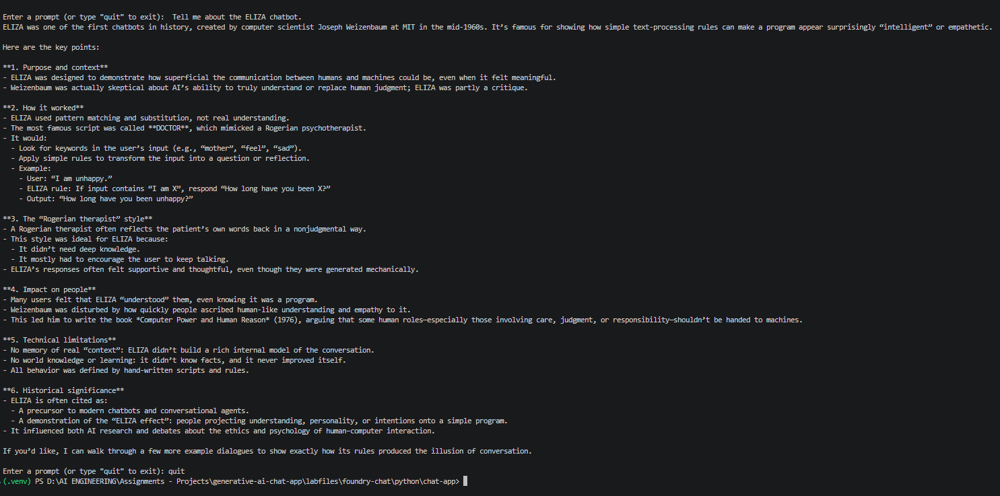
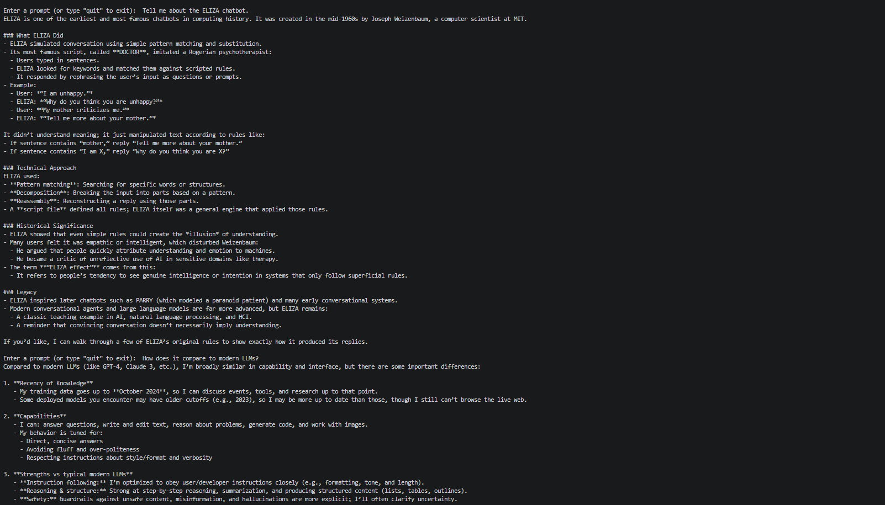
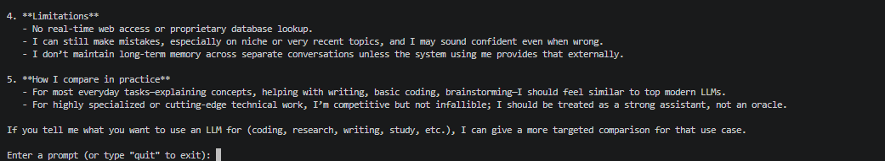
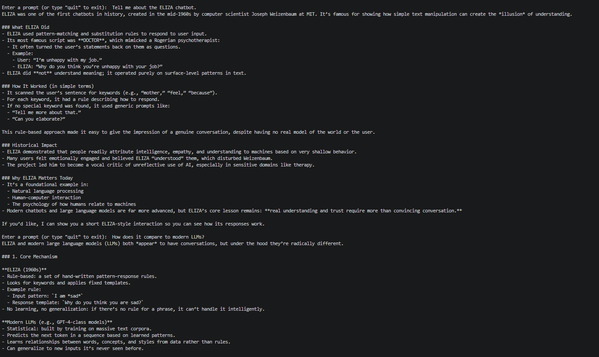
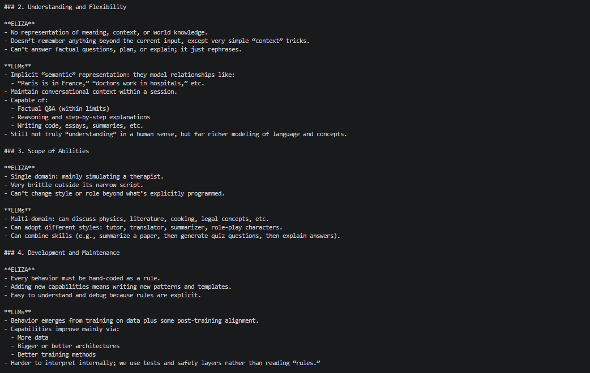
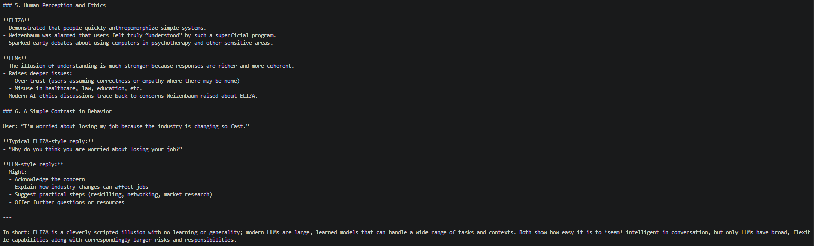
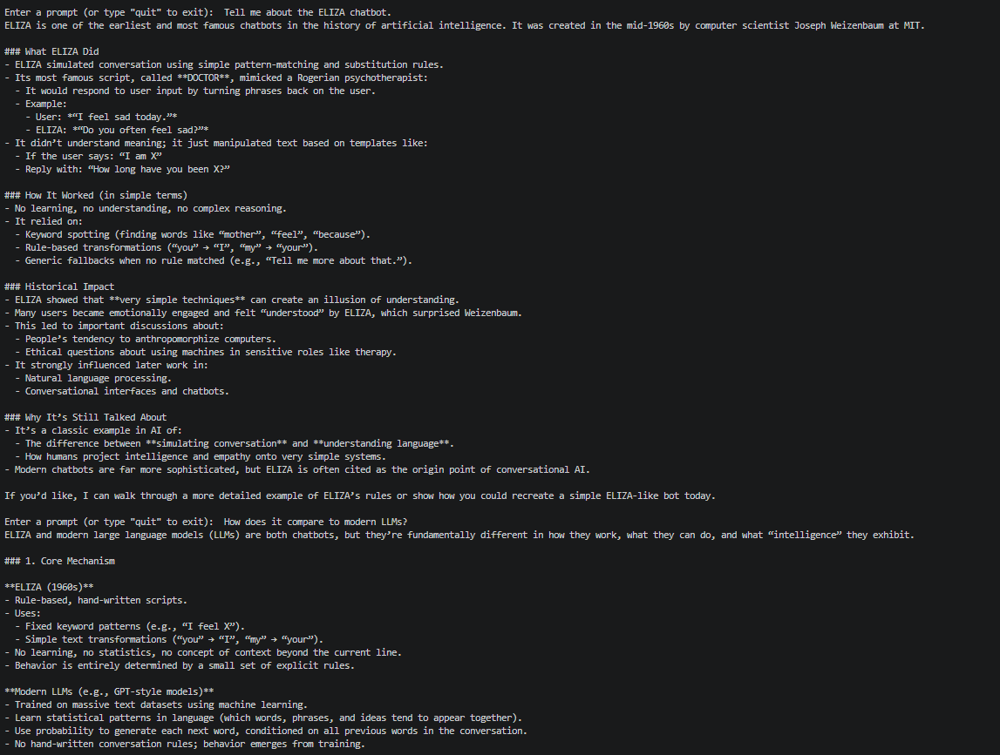
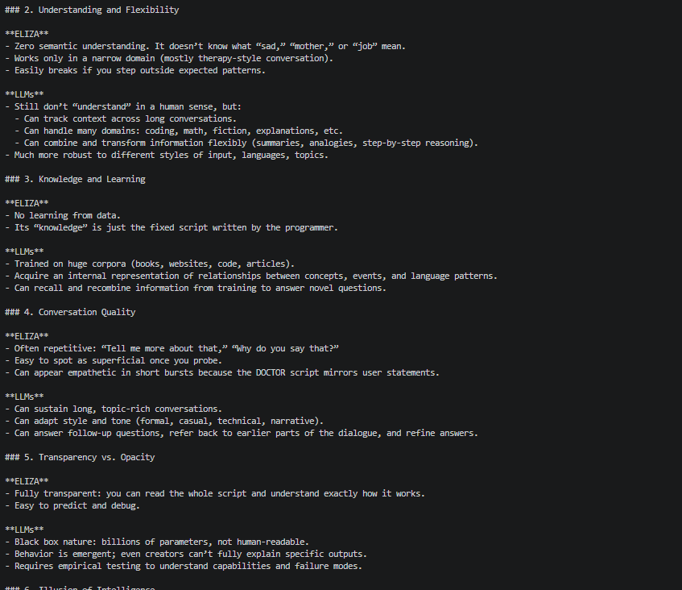
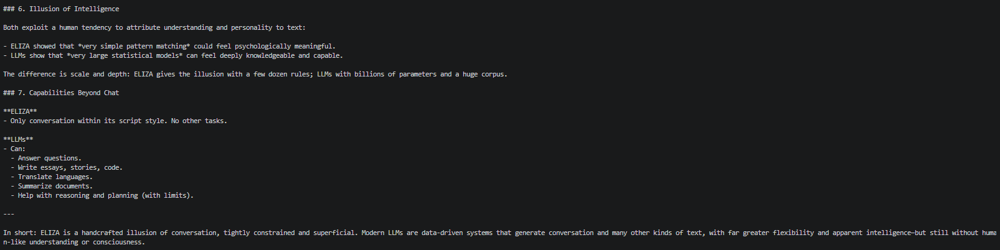
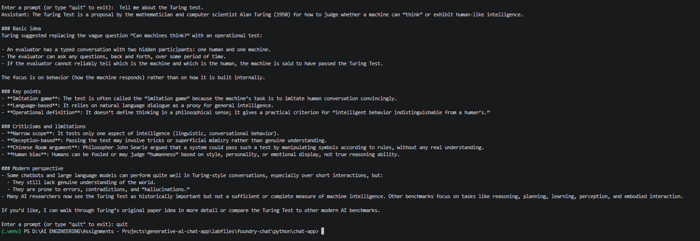

# Generative AI Chat App with Microsoft Foundry

A hands-on exercise building a chat application with the **OpenAI SDK** and **Responses API**, connected to a GPT model deployed in a **Microsoft Foundry** project. The app evolves from a basic ChatCompletions call to a fully async, streaming, context-aware chatbot.

## Overview

This project demonstrates:

- Deploying a model (`gpt-5.1`) in Microsoft Foundry
- Connecting to it via the Azure OpenAI endpoint using **Entra ID authentication**
- Using the legacy **ChatCompletions API**
- Migrating to the newer **Responses API**
- Maintaining **conversation context** across turns
- Implementing **streaming responses**
- Building an **asynchronous** version of the client

## Prerequisites

- An active Azure subscription
- Visual Studio Code
- Python 3.13.x (tested on 3.13.12)
- Git
- Azure CLI

## Project Structure

```
labfiles/foundry-chat/python/chat-app/
├── .env                # Configuration (endpoint + deployment name)
├── requirements.txt    # Python dependencies
├── chat-app.py         # Sync chat app (ChatCompletions → Responses → streaming)
└── chat-async.py       # Async chat app using Responses API
```

## Setup

1. Create a Microsoft Foundry project and deploy the `gpt-5.2` model.
2. Copy the **Azure OpenAI Endpoint** (not the project endpoint) from the project's Home page.
3. Clone this repo and open it in VS Code.
4. Create a Python 3.13 virtual environment and install dependencies:

   ```bash
   pip install -r requirements.txt
   ```

5. Update `.env` with your Azure OpenAI endpoint and model deployment name.
6. Authenticate with Azure:

   ```bash
   az login
   ```

## Walkthrough & Results

### 1. ChatCompletions API

Basic request/response using the well-established `chat.completions.create` method with a system and user message.

```bash
python chat-app.py
```

**Prompt:** `Tell me about the ELIZA chatbot.`



### 2. Responses API

Replaced ChatCompletions with the simpler `responses.create` call (`instructions` + `input`). Without context tracking, follow-up questions like *"How does it compare to modern LLMs?"* fail because the model has no memory of the prior turn.




### 3. Conversation Tracking

Added `previous_response_id` tracking so each new request references the prior response, preserving conversational context across turns.





### 4. Streaming Responses

Enabled `stream=True` and processed `response.output_text.delta` events to print text incrementally as it's generated, improving perceived responsiveness for long answers.





### 5. Asynchronous Client

Built `chat-async.py` using `AsyncOpenAI` and `azure.identity.aio` to await responses asynchronously — useful for improving responsiveness in apps with long-running model or agent operations.

```bash
python chat-async.py
```

**Prompt:** `Tell me about the Turing test.`



## Key Concepts

| Concept | Description |
|---|---|
| **Entra ID Auth** | Uses `DefaultAzureCredential` + bearer token provider instead of API keys |
| **ChatCompletions API** | Legacy, message-array-based conversation format |
| **Responses API** | Newer, simpler API using `instructions` and `input` params |
| **`previous_response_id`** | Mechanism for maintaining conversation context |
| **Streaming** | Processes response deltas as they arrive instead of waiting for the full response |
| **Async client** | `AsyncOpenAI` for non-blocking model calls |

## Cleanup

To avoid unnecessary Azure costs, delete the resource group created for this exercise:

1. Open the Azure portal → resource group used for this project
2. Select **Delete resource group**
3. Confirm by entering the resource group name

## Reference

Source exercise: [MicrosoftLearning/mslearn-ai-studio](https://github.com/microsoftlearning/mslearn-ai-studio)
